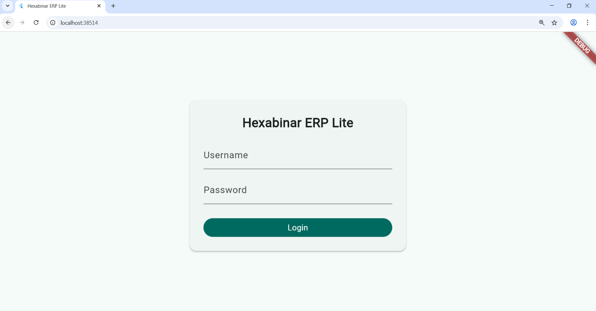
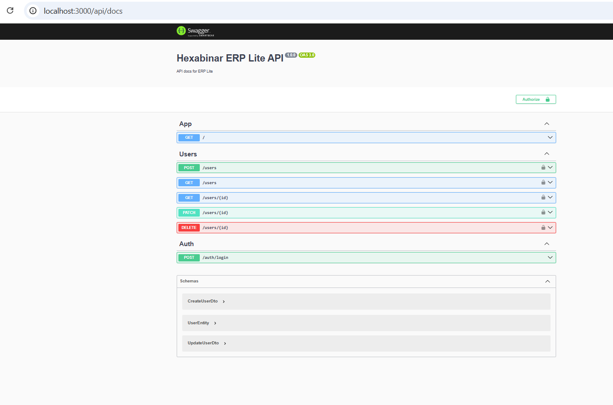

# 🧩 Hexabinar ERP Lite — Public Showcase

> **A lightweight, modular, and AI-ready ERP system**  
> designed and developed by **[Hexabinar](https://www.hexabinar.com)**  
> to bring smart digital transformation to small and medium businesses.

---

## 🏢 About Hexabinar
**Hexabinar** is a next-generation digital studio specializing in:
- 🔹 **Web & Mobile Applications**
- 🔹 **AI-Driven Software Solutions**
- 🔹 **Cloud, ERP, and Security Systems**

🌍 Website: [www.hexabinar.com](https://www.hexabinar.com)  
📧 Contact: [contact@hexabinar.com](mailto:contact@hexabinar.com)

---

## ⚙️ Project Overview

**Hexabinar ERP Lite** is a modular ERP platform built for speed, security, and simplicity.  
It combines a robust NestJS backend with a modern Flutter Web frontend.

### 🧱 Core Modules:
| Module | Description |
|--------|-------------|
| 🧩 Users & Roles | Authentication and access control using JWT and RBAC |
| 🏢 Warehouses & Stocks | Manage inventory levels, products, and suppliers |
| 💰 Invoices & Payments | Streamlined billing and payment workflows |
| 📦 Products | Multi-category product management |
| 📊 Dashboard | Real-time analytics and management panel |

---

## 🧠 System Architecture

├── backend/ # NestJS + Prisma + PostgreSQL + Docker
│ ├── src/
│ ├── prisma/
│ ├── Dockerfile
│ └── swagger.config.ts
├── frontend/ # Flutter Web App (Login + Dashboard)
│ ├── lib/
│ ├── web/
│ ├── assets/
│ └── pubspec.yaml
└── docs/
├── ERD.png
└── screenshots/
├── login_screen.png
├── swagger_ui.png
├── warehouse_page.png
└── dashboard.png

---

## 🧰 Tech Stack

| Layer | Technology |
|--------|-------------|
| **Backend** | NestJS • Prisma ORM • PostgreSQL |
| **Frontend** | Flutter Web |
| **Auth** | JWT • Role-based Access Control |
| **DevOps** | Docker Compose • GitHub Actions (planned) |
| **Docs** | Swagger UI • ERD via dbdiagram.io |

---

## 🧾 API Documentation

The API is documented using **Swagger UI** and runs at:  
`http://localhost:3000/api/docs` (in development mode)

> Backend is containerized via Docker for modular and easy deployment.

---

## 🖥️ Frontend Preview

| Login UI | Dashboard UI |
|-----------|--------------|
|  |  |

---

## 🔒 Repository Access

> 🚫 The full source code of the backend and frontend is **private** for commercial reasons.  
> This public showcase includes **non-sensitive structure**, **documentation**, and **previews** only.

### Related Repositories:
- 🔹 [Backend (NestJS + Prisma)](https://github.com/hexabinar/Hexabinar_ERP_Lite_backend)
- 🔹 [Frontend (Flutter)](https://github.com/hexabinar/Hexabinar_ERP_Lite_frontend)

---

## 📦 Deployment Plan (Upcoming)
- ☁️ Dockerized microservices with PostgreSQL volume mapping  
- 🚀 CI/CD integration via GitHub Actions  
- 🔐 Production-ready environment (AWS / Vercel)

---

## 🧭 Vision
> “To empower small businesses with intelligent, modular, and affordable ERP systems —  
> built with AI, security, and design excellence in mind.”

---

## 🏁 License & Copyright
© 2025 **Hexabinar**. All rights reserved.  
This repository is for **showcase and educational purposes only** —  
Redistribution of core source code is strictly prohibited without written permission.

---

⭐ **If you like this project, give it a star to support Hexabinar’s open innovation!**
